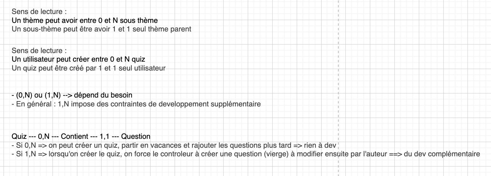
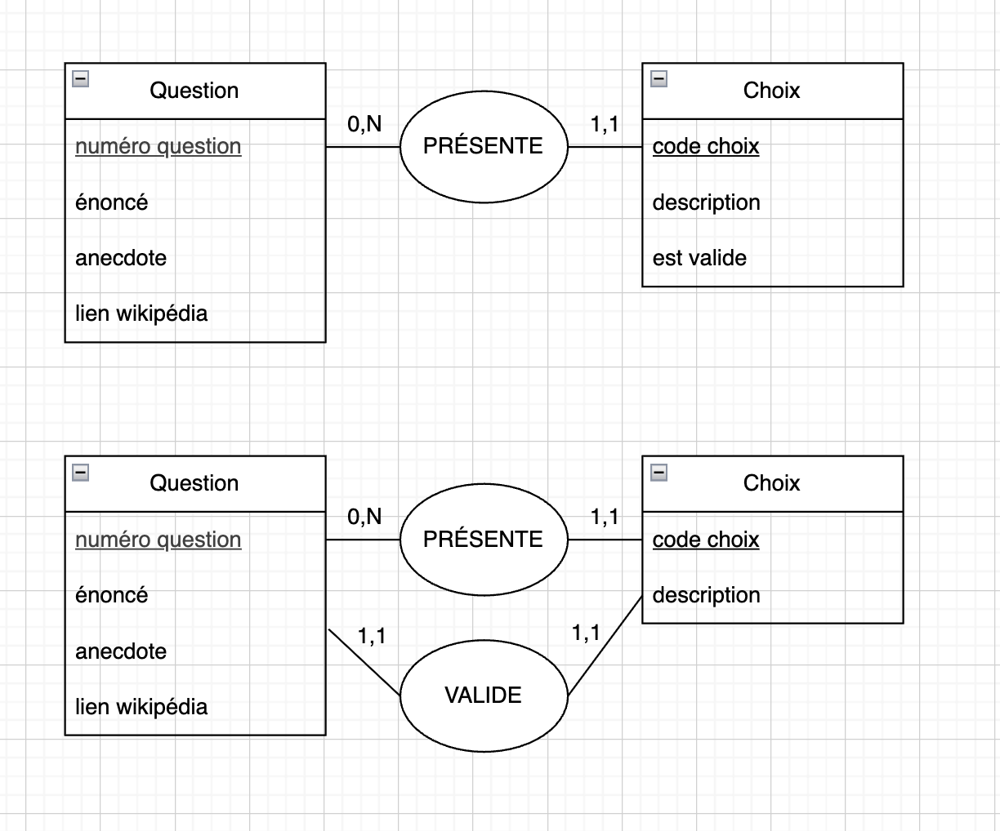
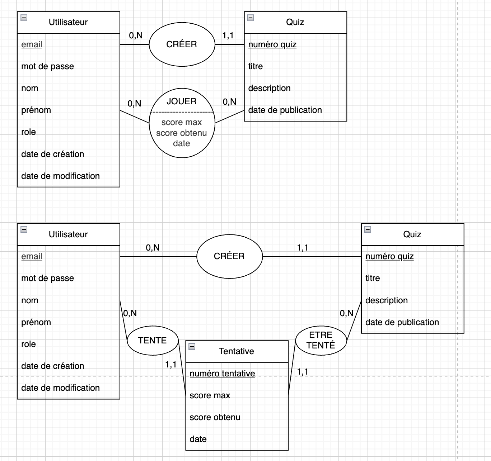

# Modèle Conceptuel de Données (MCD)

Rappel : 
- exercice académique (jurés pointilleux)
- vocabulaire précis (idem)
- "qu'est-ce qu'on a besoin de stocker ?"

Rendu attendu : 
- **schéma**

Objectif : 
- ce n'est pas de définir la BDD, mais de **clarifier le besoin de stockage** et comment les différentes entités sont liées entre elles

Conseil :
- commencer par un brouillon à l'écrit avant d'attaquer le schéma

## Règles et vocabulaire

- MCD : rédigé en français (🇫🇷)
- Document conceptuel et non technique : 
  - On NE précise PAS les types des données sur le MCD
  - On NE précise PAS non plus les id, ni les clés étrangères

Vocabulaire : 
- On parle d'entité (et pas de tables)
- On parle d'attributs (et non pas de champs/colonnes)
- On parle de discriminant/déterminant (et non pas d'ID ni clé primaire)
- On parle de cardinalités et d'associations (et non pas d'ID ni étrangères)

Eviter également le mot "relation" (c'est un faux amis, car en anglais/math : `relation === table`)

## Brouillon

(on ne le montre pas au juré, c'est pour nous aider dans la reflexion)

- **Etape 1** : définir les entités et leurs attributs
- **Etape 2** : choisir un déterminant par entité
  - l'attribut qui caractérise de manière unique un représentant de l'entité


```
Utilisateur (
  _email
  nom
  prenom
  mot de passe 
  tentatives (-->)
  role
  date de création de compte
  date de dernière modification
)

Quiz (
  _numéro quiz
  titre
  description
  questions (-->)
  auteur (-->)
  thèmes (-->)
)

Thèmes (
  _nom
  sous thèmes (-->)
)

Question (
  _numéro question
  énoncé
  anecote
  lien wikipédia
  niveau (-->)
  choix (-->)
)

Choix (
  _code choix
  description
  est valide
)

Niveau (
  _nom
)

Tentative (
  _numero tentative
  date
  score max atteignable
  score obtenu
  quiz (-->)
  utilisateur (-->)
)
```


- Si l'attribut est "pluriel" : besoin d'une entité supplémentaire

- Si on veut pouvoir faire un CRUD (CREATE, READ, UPDATE, DELETE) dynamique sur l'attributs : 
  - alors mieux vaut faire une entité
  - sinon, pas nécessaire


## Schématisation

Conseil : 
- `MoCoDo` : ❌ 
  - éventuellement pour mettre au propre
  - surtout si on veut maintenir nos schémas sous forme de code comme avec PlantUML
- `Draw.io`
  - car il existe une intégration VSCode
  - Extension : `Draw.io integration (Henning Dieterichs)` à installer
  - il suffit de créer un fichier avec l'extension `.drawio`

Règles : 
- entité : rectangle
- souligner les déterminant
- associations : oval avec les cardialités de part et d'autre
  - verbe à l'indicatif ou l'infinitif
  - éventuellement à la voix passive

## Notes








