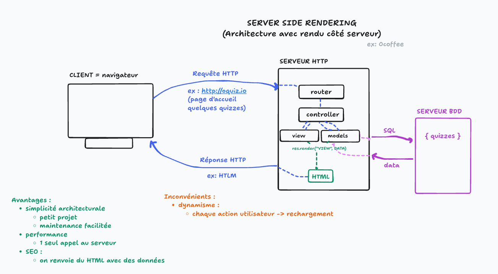
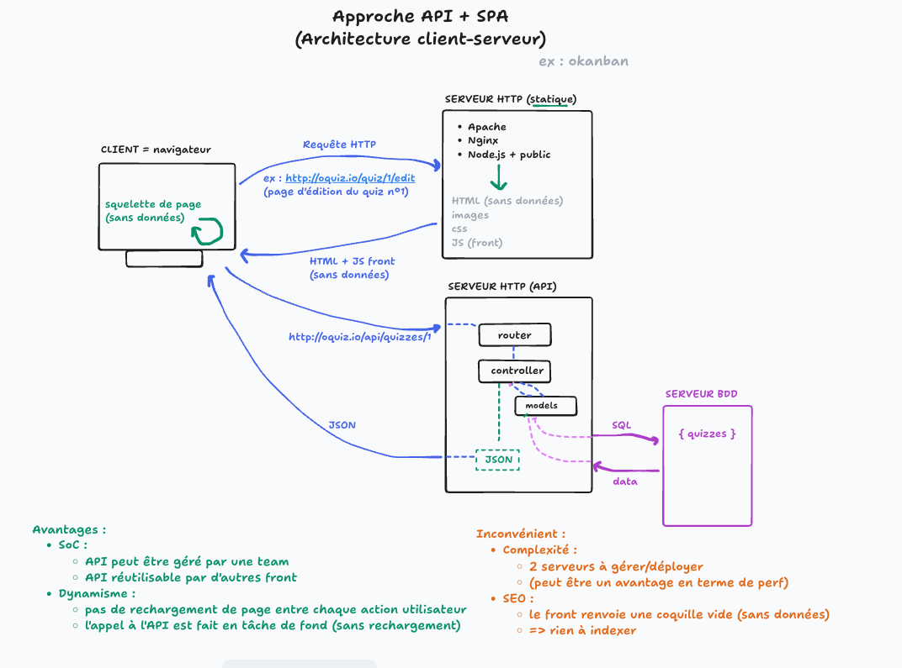
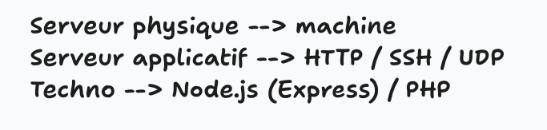

# SC01E01 - Gestion de projet et modélisation UML

## Menu du jour 

- Présentations
  - Brise glace
  - Bloc C & Titre Pro

- Gestion de projet
  - Demande client (vidéo)
  - Clarification du besoin
  - Récits utilisateur

- Modélisation UML
  - Outillage PlantUML
  - Différents diagrammes
  - Diagramme : cas d'utilisation

- Challenge
  - Analyse du besoin
  - Récits utilisateur
  - UML : cas d'utilisation

## Architecture







## User stories

[Voir le cours](../conception/analyse-besoin/user-stories.md)

## UML

**Unified Modeling Language** = Langage graphique pour modéliser un système (ou une partie d'un système)

Divers graphiques : 
- diagramme de séquence
- diagramme cas d'utilisations (use case)
- diagramme de classe
- diagramme de déploiement
- diagramme d'activité

Objectifs :
- clarifier le besoin
- communiquer avec les collègues

Outils : 
il existe plusieurs outils et/ou language pour construire ces diagrammes UML : 
- `PlantUML` (✅ pour nous)
- `Mermaid` (Intégration avec le Markdown)
- outils graphiques : `Draw.io` / `TLDraw`

[Voir les schéma](../conception/uml/[cas%20d'utilisation]/)

## Installation de Docker 

- **Pour ceux qui ont besoin uniquement**
- Sur **Ubuntu** :
  - sinon installer `Docker Desktop`
- Sinon on peut suivre la [documentation pour Ubuntu](https://docs.docker.com/engine/install/ubuntu/)

<details><summary>
Installation Docker
</summary>


```bash
# Add Docker's official GPG key:
sudo apt-get update # mdp sudo : par dessus les nuages
sudo apt-get install ca-certificates curl
sudo install -m 0755 -d /etc/apt/keyrings
sudo curl -fsSL https://download.docker.com/linux/ubuntu/gpg -o /etc/apt/keyrings/docker.asc
sudo chmod a+r /etc/apt/keyrings/docker.asc

# Add the repository to Apt sources:
echo \
  "deb [arch=$(dpkg --print-architecture) signed-by=/etc/apt/keyrings/docker.asc] https://download.docker.com/linux/ubuntu \
  $(. /etc/os-release && echo "${UBUNTU_CODENAME:-$VERSION_CODENAME}") stable" | \
  sudo tee /etc/apt/sources.list.d/docker.list > /dev/null
```

```bash
# Remettre à jour les packages
sudo apt-get update

# Installation
sudo apt-get install docker-ce docker-ce-cli containerd.io docker-buildx-plugin docker-compose-plugin
# Confirmer avec 'y'
```

```bash
# Confirmation de l'installation 
sudo docker run hello-world
# ==> Hello World!
```

```bash
# Pour éviter d'avoir à taper "sudo" pour toutes les commandes Docker, on peut ajouter l'utilisant courant (student / `whoami`) dans le groupe de permissions (Linux) Docker
sudo usermod -aG docker $USER

# Redémarrer le service docker
sudo systemctl restart docker

# Redémarrer le système (si besoin)
sudo reboot
```

</details>


## Exercices (20min)


Une fois que l'installation de l'extension PlantUML est OK, vous pouvez au choix : 
- 1) Modéliser un **site ecommerce**, en suivant un petit énoncé que je vais vous fournir
- 2) Modéliser un **robot d'inspection spatial**, en suivant un petit énoncé que je vais vous fournir
- 3) Modéliser une **bibliothèque**, sujet libre ! 

L'idée : vous familiariser avec la SYNTAXE plantUML. Pas d'attendu particulier sur la solution ici. 

### Site ecommerce

```
' Ce système peut être consulté par les clients finaux ainsi que par des administrateurs de la plateforme.
' Le client peut rechercher des produits et les ajouter à son panier. 
' Il a la possibilité de passer une commande, ce qui inclut obligatoirement le paiement ainsi que l’envoi d’un e-mail de confirmation. 
' Le client peut aussi consulter l’historique de ses commandes, mais cette fonction est accessible uniquement après s’être connecté. 
' Par ailleurs, il faut s'être inscrit une première fois pour pouvoir se connecter par la suite.
' L’administrateur, quant à lui, peut gérer les produits du site, c’est-à-dire ajouter, modifier ou supprimer des produits, ainsi que gérer les commandes reçues. 
```

### Robot navigation

```
' Rovnet est un robot télécommandé utilisé pour l'inspection à distance. 
' Le technicien interagit avec le système rovnet pour visualiser l'environnement, ce qui inclut le démarrage d'une campagne et la réception des données de distance. 
' Les fonctionnalités de prise de photos et de pilotage de la caméra étendent le cas d'utilisation principal de visualisation de l'environnement. 
' Le technicien peut également archiver les photos prises.
```
