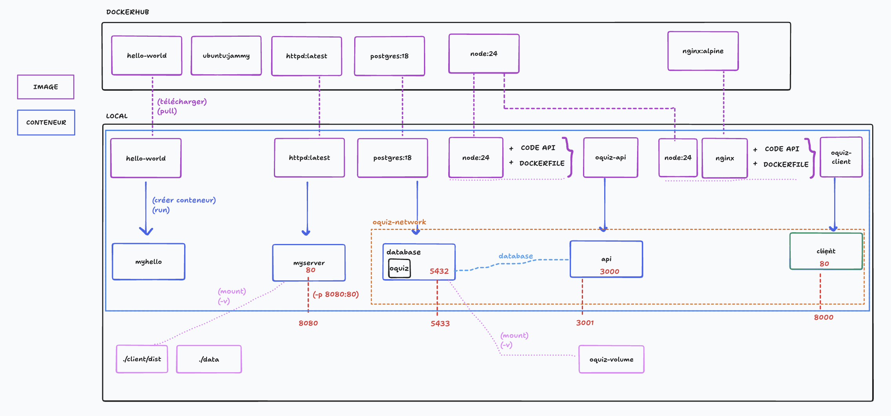
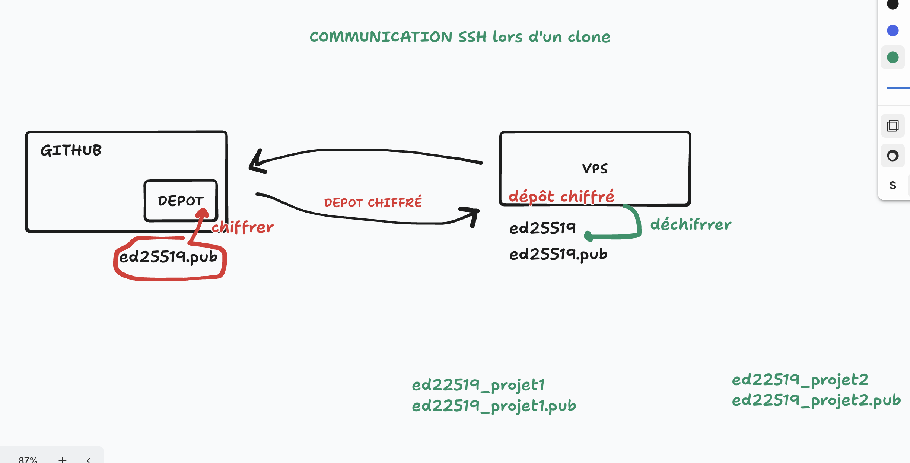
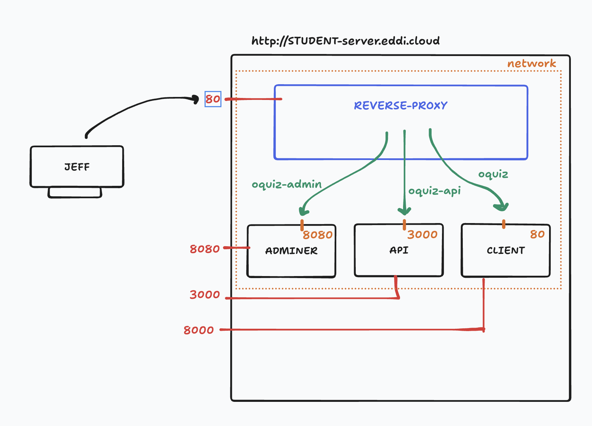

# SC02E02 - Déploiement

## Menu du jour

- Correction
  - Dockerfile (client)
    - notion : multi-stage build
    - notion : variable d'environnement et argument de build
  - Compose :
    - ajout du client
    - ajout des variables d'environnement

- VM Kourou (VPS)
  - Discuter des différentes solutions d'hébergement existantes
  - Connexion SSH
  - Installation Docker
  - Cloner (GitHub SSH key)

- Déploiement
  - Variables d'environnement
  - Lancement des conteneurs
  - Bonus : reverse Proxy Nginx

- Challenge
  - Refaire le déploiement (si non terminé)
    - choix : mode popcorn
    - choix : livecode
    - choix : kho lanta
  - Diagramme de déploiement UML


## Vocabulaire

- **Téléporteur** = VM locale (habituelle)
  - via `VirtualBox`

- **VPS** = VM Cloud = VM Kourou
  - via `SSH` et `https://kourou.oclock.io/ressources/vm-cloud/`


=> On réinstalle son VPS via l'interface histoire de faire un déploiement depuis une machine neuve !


## Correction Dockerfile `client`

Pour la mise en production du Client, il faut : 
- partir de `node:24`
- build le client
- lancer un serveur statique sur le `dist`

- Jusqu'à présent, on sert notre dist avec `npm run preview` => adapté au dev mais pas à la prod
- Utilisons maintenant Nginx : on prend notre dossier `dist` et on le sert avec `nginx`


## Résumé des ports 

**En local avec Docker** (dans l'optique de le faire en production) :

- Serveur Postgres (`BDD`) 
  - `5433` (local) -> `5432` (conteneur)

- Serveur HTTP Node.js (`API`)
  - `3001` (local) -> `3000` (conteneur)

- Serveur HTTP (Nginx) (`Client`)
  - `8000` (local) -> `80` (conteneur)

- Serveur HTTP (Apache) (`Adminer`)
  - `8080` (local) -> `8080` (conteneur)


Rappellons nous : 
- notre setup Docker est uniquement **destiné à la production** ! 
  - nos conteneurs, on s'en sert pas en local, si ce n'est pour tester notre future production.
- pour développer, on utilisera nos outils installés en local habituel
  - Postgres : `5432`
  - Node.js API : `3000`
  - Vite dev : `5173`


```bash
# Tout est bon !

CONTAINER ID   IMAGE          COMMAND                  CREATED         STATUS         PORTS                                         NAMES
6c9bc4ae3e12   oquiz-client   "/docker-entrypoint.…"   2 minutes ago   Up 2 minutes   0.0.0.0:8000->80/tcp, [::]:8000->80/tcp       oquiz-client-1
d152f26977ba   adminer:5      "entrypoint.sh docke…"   2 minutes ago   Up 2 minutes   0.0.0.0:8080->8080/tcp, [::]:8080->8080/tcp   oquiz-adminer-1
9eb26c0fcd57   oquiz-api      "docker-entrypoint.s…"   2 minutes ago   Up 2 minutes   0.0.0.0:3001->3000/tcp, [::]:3001->3000/tcp   oquiz-api-1
ea0421b52b8e   postgres:18    "docker-entrypoint.s…"   2 minutes ago   Up 2 minutes   0.0.0.0:5433->5432/tcp, [::]:5433->5432/tcp   oquiz-database-1

# On peut tout à fait supprimer conteneurs et images du local à présent, car on sait que ça devrait fonctionner en production
```




## Variable d'environnement pour Docker Compose

On créé deux fichiers : 
- `.env.docker` : pour la production (non versionné)
- `.env.docker.example` : pour le local (pour tester)

Quand on lance les services avec compose : 

```bash
# Local
docker compose -p oquiz -f docker-compose.yml --env-file=.env.docker.example up -d 

# Prod
docker compose -p oquiz -f docker-compose.yml --env-file=.env.docker up -d 
```

Utiliser les variables

```yml
services:
  # remplace le lancement de la commande "docker run"
  database:
    image: postgres:18
    restart: unless-stopped # redémarre la BDD si elle s'est arrêté (à moins qu'on l'ai stoppée manuellement). Ex : si on redemarre la machine -> redemarre la BDD
    environment:
      - POSTGRES_USER=${POSTGRES_USER}
      - POSTGRES_PASSWORD=${POSTGRES_PASSWORD}
      - POSTGRES_DB=${POSTGRES_DB}
    ports:
      - 5433:5432
    volumes:
      - oquiz-volume:/var/lib/postgresql/18/docker
    networks:
      - oquiz-network
```


## GitFlow

Après la pause, chacun va pouvoir (si vous le souhaiter) déployer son PROPRE dépôt EN PRODUCTION (--> VPS)

Je vous invite donc à faire le `GitFlow` pour mettre à jour votre branche `master` 

- `git checkout master`
- `git fetch prof`
- `git reset --hard prof/main`
- `git push --force`     (✅ important comme ça `master` sera à jour sur GitHub et donc le code que l'on va cloner en prod sera bon !)


## Hébergement

Deux grandes approches pour déployer un projet : 
- **On premise** : on achète une machine que l'on gère nous même
  - ex : le serveur sous l'escalier
  - ex : le Rasberry PI / vieux PC sous Linux connecté à internet pour notre site vitrine
- **Cloud** : on loue une machine chez un hébergeur

Hébergeur Cloud :
- `OVH` (🇫🇷)
  - Kimsufi
- `O2Switch` (🇫🇷)
- `AWS` (Amazon Web Service)
- `GCP` (Google Cloud Platform)
- `Azure` (Microsoft Azure)
- `Digital Ocean`
- `Surge` (CDN)
- `Hostinger`

Surcouche d'hébergement
- `GitHub Pages`
- `Netlify`
- `Render`
- `Railway`
- `Vercel`
- `Heroku`


**IaaS** = Infrastructure as a Service
- on loue l'infrastructure, la machine connecté à internet
- on paie pour l'infrastructure qu'on nous met à notre disposition
- ex : VPS Kourou (Virtual Private Server) qu'on loue chez AWS aujourd'hui

**PaaS** = Plateform as a Service
- l'hébergeur nous fourni une "plateforme", ie. une sorte de surcouche à l'infrastructure pour faciliter la mise en production et la maintenance
- ex : Vercel, Github Pages, Heroku 
- avantage : la plupart des softs sont déjà installés, on va juste "déposer" nos fichiers.
- avantage : généralement la plateforme offre du monitoring, de la sécurité complémentaire

**SaaS** = `Software as a Service`
- on loue un service, un logiciel prêt à l'emploi
- on paie pour le service qu'on nous met à disposition
- ex : Dropbox / Google Drive / BBB / Trello / Figma / Gmail 
- avantage : plug and play pour notre utilisation

**DBaaS** = Database as a Service
- un type de PaaS où la plateforme fournie est une base de données (Postgres)
- ex : MongoAtlas


Offres Cloud :

- **Serveur dédié physique** = **Bare metal** = loue la machine complète
  - avantage : profite de toute la puissance de la machine
  - inconvénient : couteux

- **Serveur dédié virtuel** = **Virtual Private Server** = **VPS** = loue une VM sur une machine
  - avantage : moins cher mais tout de même isolé : on reste propriété de notre propre espace
  - avatange : généralement on a les accès **root** : on peut installer les softwares que l'on souhaite (Postgres, Node, PHP...)
  - inconvénient : moins de puissance (à nuancer), certains clients refusent parfois d'avoir leurs données sur le même serveur que d'autres client

- **Serveur mutualisé** = on loue une VM sur une machine mais avec des logiciels déjà installé
  - ex : un hébergement Wordpress chez OVH (avec PHP et MySQL déjà préinstallé)
  - avantage : encore moins cher
  - inconvénient : pas souvent les accès **root** : on installe pas ce qu'on veut


Dans notre cas, on va héberger Oquiz sur un VPS chez AWS. Pour cela, on loue un serveur en passant par la page d'administration des VM : 
- https://kourou.oclock.io/ressources/vm-cloud/
- On démarre sa VM (et/ou on la réinitialise si ce n'était pas fait)


## Se connecter au VPS

**SSH** = **Secure SHell** = protocole de communication, généralement utilisé pour prendre le controle d'une machine à distance

```bash
# On repère sur la page de gestion de la VM l'adresse SSH de notre VPS et on l'entre
ssh student@PSEUDO-server.eddi.cloud  # avec l'espace entre ssh et l'adresse
```

### Cas 1 : Bloc C

```bash
# On vous demande de confirmer : 
Are you sure you want to continue connecting (yes/no/[fingerprint])?

# Réponse
yes

# Vérification : le prompt devient : 
student@PSEUDO-server:~$
```

## Cas 2 : Bloc A + B

```bash
ssh student@PSEUDO-server.eddi.cloud

@@@@@@@@@@@@@@@@@@@@@@@@@@@@@@@@@@@@@@@@@@@@@@@@@@@@@@@@@@@
@ WARNING: REMOTE HOST IDENTIFICATION HAS CHANGED! @
@@@@@@@@@@@@@@@@@@@@@@@@@@@@@@@@@@@@@@@@@@@@@@@@@@@@@@@@@@@
IT IS POSSIBLE THAT SOMEONE IS DOING SOMETHING NASTY!
Someone could be eavesdropping on you right now (man-in-the-middle attack)!
It is also possible that a host key has just been changed.
The fingerprint for the ED25519 key sent by the remote host is
SHA256:F3D/JDtMzK8r0lSbS52oIGsQR3dTPyZ/W4IUTQrkjV8.
Please contact your system administrator.
Add correct host key in /home/student/.ssh/known_hosts to get rid of this message.
Offending ECDSA key in /home/student/.ssh/known_hosts:6
remove with:
ssh-keygen -f '/home/student/.ssh/known_hosts' -R 'PSEUDO-server.eddi.cloud'
Host key for PSEUDO-server.eddi.cloud has changed and you have requested strict checking.
Host key verification failed.
```

Puisque qu'on a REINSTALLÉ la VM, l'ID du serveur a changé, donc notre hôte (local) pense qu'il est possible que quelqu'un écoute notre communication avec notre serveur. Rassurons nous, on sait que le problème vient de notre réinstallation. Donc on ignore le warning et : 

```bash
# Pour retirer l'erreur (remplacer bien sur par votre pseudo)
ssh-keygen -f '/home/student/.ssh/known_hosts' -R 'PSEUDO-server.eddi.cloud'

# Puis on retombe sur le cas du bloc C : 
# On se connecte en SSH
ssh student@PSEUDO-server.eddi.cloud

# On vous demande de confirmer : 
Are you sure you want to continue connecting (yes/no/[fingerprint])?

# Réponse
yes

# Vérification : le prompt devient : 
student@PSEUDO-server:~$
```

A partir d'ici, vérifier bien votre **prompt** : 

```bash
# Téléporteur (VM locale)
student@teleporter:~$

# VPS (VM Cloud)
student@PSEUDO-server:~$

# Pour passer de l'un à l'autre : 
exit # quitter le VPS -> on retourne sur le téléporteur
ssh student@PSEUDO-server.eddi.cloud # pour retourner sur le VPS
```

## Bienvenue sur votre VPS

Quelques commandes Linux pratiques. 

Idée : faire le tour du propriétaire

```bash
# Info système
uname -a 

# Nom de l'hôte
hostname

# Nom de l'utilisateur courant
whoami

# Version d'Ubuntu
lsb_release -a

# Dossier courant
pwd

# Voir les variables d'env
printenv

# Espace libre
df -h

# Gestionnaire des tâches (liste des processus)
htop
# Quitter : touche 'q'

# Liste des processus (à l'instant T)
ps aux

# Vérifier les ports utilisés 
sudo ss -tuln
# MDP sudo (root) de votre VPS : par dessus les nuages
```

## Mettre à jour sa machine 

**APT** = **Advaced Package Tool** = un gestionnaire de packets pour Linux

- `APT` (pacman, snap) est à Linux ce que `NPM` (yarn, pnpm) est à Node.js

| OS      | Gestionnaire de packet |
| ------- | ---------------------- |
| Windows | Chocolatey             |
| MacOs   | HomeBrew               |
| Linux   | APT, pacman, snap      |


```bash
# Mettre à jour la liste des paquets Linux (ie, l'annuaire des paquets)
✅ sudo apt update

# Mettre à jour les packages déjà installés sur le système
✅ sudo apt upgrade
# Répondre "y" pour accepter les mises à jour

# Il est possible que vous tombiez sur un ECRAN ROSE => pour mettre à jour le noyau et/ou relance les services
# Appuyer sur ENTER (plusieurs fois si besoin)


# Après une mise à jour importante des packages, bonne pratique : 
# Redémarrer le système
sudo reboot

# Patiente 30 secondes et on se reconnecte 
ssh student@PSEUDO-server.eddi.cloud
```


## Préparation de l'environnement de production

**Sans Docker**, on aurait besoin de : 
- Du dépôt cloné
- PostgreSQL
- Node.js 24 (donc NVM)
- Installer NGINX
- Créer la BDD à la main
- D'installer les dépendances à la main
- Créer le build backend et client
- Gérer les variables d'environnement par service
- Lancer les commandes pour démarrer l'API à la main + Nginx


**Avec Docker**, on a besoin de : 
- Du dépôt cloné
- Docker installé
- Gérer les variables d'environnement `.env.docker`

### Installer Docker

Pour l'installer, on suit la [documentation pour Ubuntu](https://docs.docker.com/engine/install/ubuntu/)

```bash
# A-t-on besoin d'installer Docker ? 
docker -v  # ==> ❌ pas de version => pas de Docker
```

```bash
# Add Docker's official GPG key:
sudo apt-get update
sudo apt-get install ca-certificates curl
sudo install -m 0755 -d /etc/apt/keyrings
sudo curl -fsSL https://download.docker.com/linux/ubuntu/gpg -o /etc/apt/keyrings/docker.asc
sudo chmod a+r /etc/apt/keyrings/docker.asc

# Add the repository to Apt sources:
# (copier toutes les lignes d'un coup)
echo \
  "deb [arch=$(dpkg --print-architecture) signed-by=/etc/apt/keyrings/docker.asc] https://download.docker.com/linux/ubuntu \
  $(. /etc/os-release && echo "${UBUNTU_CODENAME:-$VERSION_CODENAME}") stable" | \
  sudo tee /etc/apt/sources.list.d/docker.list > /dev/null
```

```bash
# Re-mettre à jour la liste des packages
sudo apt-get update

# Installation
sudo apt-get install docker-ce docker-ce-cli containerd.io docker-buildx-plugin docker-compose-plugin
# MDP : par dessus les nuages
# Confirmer l'installation avec 'y'


# Confirmation de l'installation 
sudo docker run hello-world
# ==> Hello World!
```


```bash
# Pour éviter d'avoir à taper "sudo" pour toutes les commandes Docker, on peut ajouter l'utilisant courant (student / `whoami`) dans le groupe de permissions (Linux) Docker
sudo usermod -aG docker $USER

# Redémarrer le service docker
sudo systemctl restart docker

# Redémarrer le système
sudo reboot # Patienter une minute que votre téléporteur redémarre

# On attend une bonne minute puis on se re-connecte à notre VPS
ssh student@PSEUDO-server.eddi.cloud

# On teste
docker run hello-world # 🎉 Fonctionne sans avoir besoin de sudo !
```

## Générer une clef SSH

```bash
❌ git clone git@github.com:O-clock-Dublin/SC01234-oquiz-PSEUDO.git
# fatal: Could not read from remote repository.
```

Raison : c'est une sécurité de GitHub, on ne peut pas cloner depuis n'importe quelle machine sans avoir les droits.

Pour avoir les droits : 
- il faut créer une paire de clef SSH sur la machine sur laquelle on souhaite cloner
- déclarer la clé publique auprès de GitHub (dans les settings du dépôt)

[Documentation](https://docs.github.com/en/authentication/connecting-to-github-with-ssh/generating-a-new-ssh-key-and-adding-it-to-the-ssh-agent)

```bash
# Générer la paire de clef SSH
# ⚠️ Remplacer par son email GitHub
ssh-keygen -t ed25519 -C "your_email@example.com"
# Choix du nom de fichier : ENTER (par défaut)
# Choix passphrase : ENTER (par défaut)
# Choix passphrase : ENTER (confirmer)

# Vérifier la bonne création de la paire SSH
ls .ssh
# id_ed25519      -> clé privé (reste au chaud)
# id_ed25519.pub  -> clé publique (la déclarer sur GitHub)

# Démarrer l'agent SSH
eval "$(ssh-agent -s)"

# Ajoutez votre clé privée SSH à ssh-agent
ssh-add ~/.ssh/id_ed25519

# Copier le contenu de la clef SSH publique
cat ~/.ssh/id_ed25519.pub
# Copier toute la ligne (y compris `ssh-ed25519 XXXXXXXXXXXXXX mail@oclock.io`)
```

## Déclarer la clef SSH auprès de GitHub

2 options possibles : 
- **Option 1** : déclarer la clef publique directement au niveau du COMPTE UTILISATEUR
  - avantage : on peut ensuite cloner n'importe quel dépôt de l'utilisateur
  - inconvénient : moins sécurisé, car n'importe qui avec accès au VPS pourra alors récupérer tous les dépôts de l'utilisateurs, mais également avec les droits d'écriture ! 
- **Option 2** : déclarer la clef publique au niveau des SETTINGS DU DEPOT
  - avantage : on ne pourra cloner que le dépôt (et on peut même choisir en lecture seul)
  - inconvénient : il faut une clef différente par dépôt (on peut pas réutiliser deux fois la même clef SSH)

Sur l'interface de Github
  - Se rendre sur son dépôt :
    - https://github.com/O-clock-Copenhague/SC01234-oquiz-PSEUDO
  - `Settings` > `Deploy Key` > `Add deploy key`
    - https://github.com/O-clock-Copenhague/SC01234-oquiz-PSEUDO/settings/keys/new
  - Remplir les champs : 
    - `Title` : VPS Kourou AWS (ou ce qu'on veut)
    - `Key` : copier/coller du terminal
      - en entier : `ssh-ed25519 .... email`
    - `Allow write access` : laisser déchoché 
  - Valide

### Cloner le dépot

```bash
# S'assurer d'être sur son VPS
hostname # ==> PSEUDO-server.cloud.eddi.xyz # ==> sinon on se reconnecte au VPS avec ssh ...

# Rester à la racine (dossier utilisateur)
cd /home/student

# Cloner le dépot 
git clone git@github.com:O-clock-Dublin/SC01234-oquiz-PSEUDO.git
# => confirmer avec "yes"

# Vérification
ls # => ✅ le dépôt est là
```



## Déploiement (enfin !)

```bash
# Toujours sur le VPS
hostname

# On se déplace dans le dépôt
cd SC01234-oquiz-PSEUDO

# On vérifie qu'on a tout ce qu'il nous faut
ls -a # => .env.docker.example + docker-compose.yml

# Créer le fichier d'environnement (en copiant l'exemple)
cp .env.docker.example .env.docker

# On édite le fichier .env.docker
nano .env.docker
# Pour sauvegarder : `CTRL + S`   ou `CTRL + O` puis ENTER
# Pour quitter : `CTRL + X`
```

```bash
# Database
POSTGRES_USER=oquiz
POSTGRES_PASSWORD=oquizsecure
POSTGRES_DB=oquiz
DATABASE_PORT=5433

# API
ALLOWED_ORIGIN=http://PSEUDO-server.eddi.cloud:8000  # le backend autorise ce front !
API_PORT=3000

# Client
VITE_API_BASE_URL=http://PSEUDO-server.eddi.cloud:3000/api  # le client appelle le backend sur cette URL
CLIENT_PORT=8000

# Adminer
ADMINER_PORT=8080


# Pour sauvegarder : `CTRL + S`   ou `CTRL + O` puis ENTER
# Pour quitter : `CTRL + X`
```

```bash
# Confirmer les variables
cat .env.docker

# Déploiement (moment de vérité)
docker compose -p oquiz -f docker-compose.yml --env-file=.env.docker up -d 

# Vérification
docker ps 
```

```bash
# On test (depuis Chrome, le même Chrome que là où vous avez l'interface de gestion des VM ouverte)
API : http://PSEUDO-server.eddi.cloud:3000/api/health
API : http://PSEUDO-server.eddi.cloud:3000/api/users

BDD : http://PSEUDO-server.eddi.cloud:8080
# Systeme : PostgreSQL
# Serveur : database
# Utilisateur : oquiz
# Mot de passe : oquizsecure
# Base de données : oquiz

CLIENT : http://PSEUDO-server.eddi.cloud:8000
```

Problématique : 
- comment Jeff va se souvenir de tous ces ports ? 
Solution : 
- rajouter **un service REVERSE-PROXY** qui va permettre d'avoir des sous domaine et des redirections vers les services appropriés

```
CLIENT : 
http://oquiz.PSEUDO-sever.eddi.cloud --> http://PSEUDO-server.eddi.cloud:8000

API :
http://oquiz-api.PSEUDO-sever.eddi.cloud  --> http://PSEUDO-server.eddi.cloud:3000

ADMINER : 
http://oquiz-admin.PSEUDO-sever.eddi.cloud --> http://PSEUDO-server.eddi.cloud:8080
```

## Reserve Proxy 

Actuellement : 

```bash
CLIENT :  http://PSEUDO-server.eddi:cloud:8000
API :     http://PSEUDO-server.eddi.cloud:3000
ADMINER : http://PSEUDO-server.eddi:cloud:8080
```

Ce qu'on veut :

```bash
CLIENT :  http://oquiz.PSEUDO-server.eddi:cloud(:80)
API :     http://oquiz-api.PSEUDO-server.eddi.cloud(:80)
ADMINER : http://oquiz-admin.PSEUDO-server.eddi:cloud(:80)
```


Note : 
- port par défaut pour HTTP  : **port 80**
  - exemple : http://httpforever.com:80
- port par défaut pour HTTPS : **port 443**
  - exemple : https://oclock.io:443


2 options pour la configuration du Reverse proxy : 
- soit un service en plus dans le docker compose
  - ==> pour profiter de Docker !
- soit directement installer Nginx sur le serveur de production et gérer à part la configuration 
  - ==> mon conseil pour l'apothéose (si beson !)


## Mettre en place le reverse proxy

- Soit Gitflow / soit rajouter manuellement le fichier `proxy/nginx.conf`
  - attention à bien mettre votre `PSEUDO` à la place du `enzoclock`

- Modifier le fichier `docker-compose.yml` pour rajouter le service `proxy`

- Commit / Push `master`

- En production : 
  - pull (master)
  - éteindre les conteneurs (`down`)
  - modifier les variables d'environnement si besoin (API_BASE_URL et/ou ALLOWED_ORIGIN)
  - relancer les conteneurs (`up`)


