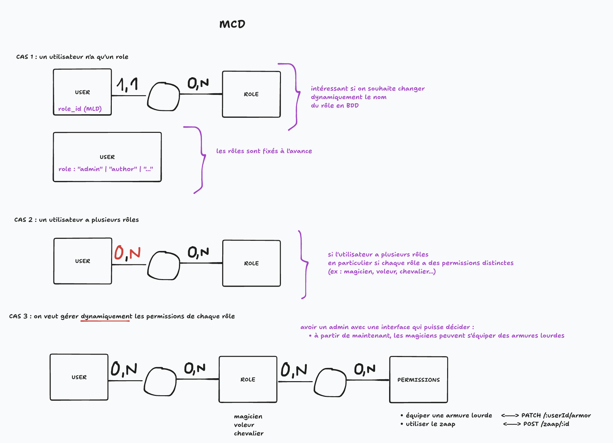

# SC03E02 - Autorisation

## Menu du jour

- Correction
  - GET `/auth/me`
  - POST `/auth/refresh`
  - POST `/auth/logout`

- Gestion des rôles et permissions
  - Vocabulaire
  - Différentes approches (`RBAC`, `ABAC`, `ACL`)
  - Design Pattern `URP` (dépôt annexe)

- Application
  - Conception : matrice RBAC
  - Implémentation : middleware d'accès `checkRole`
  - Tests : `authedRequester`

- Dépôts annexes
  - Exemple d'auth complète 
    - CSRF protection, front vanilla...
  - Exercice d'auth simplifié
    - pas de refresh, stockage localStorage, front React, JS...
  - Exemple URP

## User Role et Permissions

## Rôles et permissions appliqués à O'quiz 

Dans O'quiz, on a : 
- un seul rôle par utilisateurs
- des permissions fixes (la logique métier est simple et prévu à l'avance par Jeff)
- peu de endpoints 

Solution : 
- RBAC
  - quelques droits ABAC
- Champ `role` (ENUM) sur notre modèle User
  - pas besoin d'une table à part
- Assigner nos rôles aux endpoints dans un router
  - pas besoin d'une table pour les permissions

## Recapitulatif du bloc C 

Conception : 
- UML
  - `Cas d'utilisation` (ex : vue globale)
  - `Sequence` (ex : échanges client/serveur)
  - `Activité` (ex : workflows)
  - `ERD` (ex : remplacer MCD/MLD)
  - `Déploiement` (ex : infra docker)
- Plan de test / définition de nos besoins
  - `User stories`
  - Conception de l'API (`endpoints`)
  - Matrice des droits (`RBAC` / `ABAC`)
- Modélisation BDD (`MERISE`)
  - (recueil de données)
  - `MCD`
  - `MLD`
  - `MPD`
  - (dictionnaire de données)
- Web design
  - `Zoning`
  - `Wireframes` (ex : Whimsical)
  - `Mockup` (ex : Figma)
  - `Prototype` (ex: Librairies de composant)
- Gestion de projet
  - Agile ≠ Waterfall/Cycle en V
  - SCRUM :
    - `daily` (meeting)
    - `kanban` (board)
    - `backlogs` (todo)
    - `sprint` (période de dev)

- Architecture : 
  - `SSR` = Server Side Rendering
    - renvoyer du HTML / CSS / IMAGE
    - rapide, SEO
  - `API`/`SPA` = microservices qui communiquent
    - frontend (SPA) : `React`, `Vue`, `Svelte` (+ `Bundler` -> `dist`)
    - backend (API) : Node.js (Express, Nest, Loopback, Adonis) / PHP
    - interactive, SOC
  - Hybride : `Next.js` / `Nuxt.js` / `SvelteKit`

- TypeScript : 
  - type de base : string / boolean / number / void / null / undefined
  - Array (tableau)
  - `interface` (objet) / Héritage d'interface
  - Enum (`type`)
  - Fonctions à typer (entrée, sortie)

- Docker : 
  - Image
    - `DockerHub` (Image de base)
    - `Dockerfile` (Construire + Code)
  - Conteneur
    - `-p`
    - `-d`
    - `-v`
    - `--name`
    - `-e`
    - jouer avec : 
      - `exec`
      - `copy`
  - Docker compose
    - gérer le lancement/extinction des conteneurs via un fichier `YML`

- VPS :
  - hébergement on premise/self-hosted
  - hébergement cloud : 
    - bare metal (machine)
    - virtual private server (VM)
    - hébergement mutualisé (VM pré-installé)

- Tests : 
  - (auto) tests unitaire (fonction isolée)
    - (manuel) `console.log`
  - (auto) tests d'intégration (une partie du système)
    - (manuel) `api.http`
  - (auto) tests E2E (du front à la BDD)
    - (manuel) `jeu d'essai de test`

- Automatisation : 
  - CI : intégration continue
    - lancement automatique du linter
    - lancement automatique des tests dans un runner
  - CD : déploiement contiue
    - déploiement automatisé sur Surge
  - Outils : GitHub Action

- Authentification : 
  - Stateful (ex : session)
  - Stateless (ex : JWT)
  - Mixte des deux (ex : JWT + Refresh Token)

  - Routes : 
    - `/auth/register` (haché le mdp)
    - `/auth/login` (généré un JWT)
    - `/auth/refresh` (généré un JWT à partir d'un refreshToken)
    - `/auth/logout` (supprimer les tokens côté front)

- Autorisation : 
  - RBAC / ABAC / ACL
  - URP : User Role Permission
  - middleware `checkRoles`
    - controler le JWT (notamment le ROLE qu'on a dedans) et laisser ou non passer l'utilisateur
