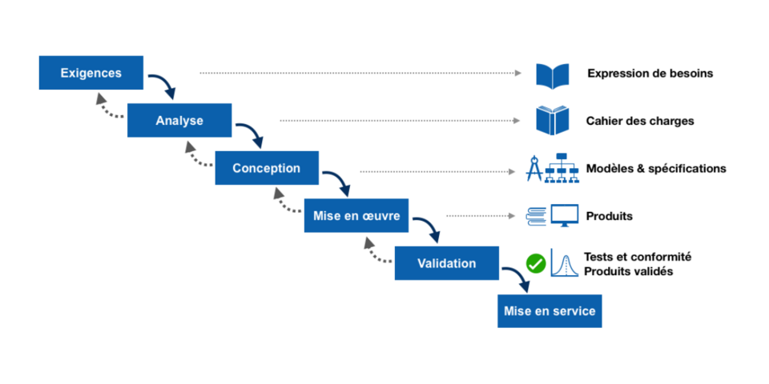

# Méthodes agiles

## Kesako ?

Il s'agit d'un ensemble :
- d'**outils**
- de **méthodologie** & **pratiques**
- de **vocabulaire**

qui visent à nous aider à nous organiser dans notre travail.

Il n'y a pas UNE méthode agile, mais plusieurs, dérivés les une des autres. Chaque entreprise adapte les méthodologies existantes à son propre fonctionnement : on suit rarement une méthode à la lettre.

Méthodes courantes : 
- **Scrum** (cf. Scrum Manifest)
- XP (Extreme Programming)
- TDD (Test Driven Development)
- FDD (Feature Driven Development)

L'idée principale de ces méthodes :
- on avance de **manière itérative**
- on recupère de manière régulière les retours des utilisateurs / clients (**feedback**)

## Comparatif : méthodes Agiles vs Méthodes Waterfall

| Critère                   | Méthodes Waterfall (Cascade/Cycle V)          | Méthodes Agiles                                |
| ------------------------- | --------------------------------------------- | ---------------------------------------------- |
| **Vision globale**        | Projet planifié de A à Z dès le départ        | Projet évolutif, adaptable en continu          |
| **Découpage du projet**   | Séquentiel : chaque phase suit la précédente  | Itératif : cycles courts (sprints)             |
| **Spécifications**        | Très détaillées et figées au début            | Adaptées à chaque itération                    |
| **Flexibilité**           | Faible : difficile de revenir en arrière      | Forte : changement accepté à tout moment       |
| **Livraison**             | Livraison unique en fin de projet             | Livraisons fréquentes et incrémentales         |
| **Implication du client** | Faible (au début et à la fin)                 | Forte (présent à chaque sprint)                |
| **Tests**                 | À la fin (après le développement)             | En continu (intégrés à chaque sprint)          |
| **Documentation**         | Très importante                               | Suffisante mais légère                         |
| **Gestion des risques**   | Tardive, peu visible                          | Précoce, risques identifiés en amont           |
| **Adapté à**              | Projets stables, bien définis (ex : bâtiment) | Projets complexes, incertains (ex : logiciels) |

| Agile                               | Cycle V                               | Cascade                               |
| ----------------------------------- | ------------------------------------- | ------------------------------------- |
|  |  |  |

### 📌 Exemples

### Projet Web en Waterfall :
1. Spécifications figées sur 2 mois.
2. Développement pendant 6 mois.
3. Livraison après 8 mois.
4. Si le besoin a changé → tout est à refaire.

### Projet Web en Agile :
1. Sprint de 2 semaines.
2. Fonctionnalité testée et livrée en continu.
3. Le client donne son retour en cours de route.
4. Le produit s’adapte à ses besoins réels.

## 🧠 À retenir
- **Waterfall** = planification rigide, bon pour les projets stables.
- **Agile** = itératif, adaptation et collaboration, idéal pour les environnements changeants.

## 🛠️ Outils et pratiques courants en Méthodes Agiles

### Product Owner (PO) / Chef de projet
- **Définition** : Personne qui s'occupe de la définition du produit, des fonctionnalités de l'application
- **Utilité** : Traduire le besoin en fonctionnalité à implémenter. Entre le chef de projet et/ou client et le reste de l'équipe. Organiser la plannification du travail (Scrum master souvent)

### QA engineer 
- **Définition** : Quality Assurance (testeur)

### Squad
- **Définition** : Groupe de personnes qui travaillent sur les mêmes fonctionnalités (même scope produit)
- **Exemple** : 1 PO + 1 Designer + 2 devs, qui travaillent sur la gestion des utilisateurs dans l'app

### 📋 Product Backlog
- **Définition** : Liste de toutes les fonctionnalités à développer.
- **Utilité** : Pilote la vision du produit ; gérée par le Product Owner.

### 🧩 Sprint
- **Définition** : Période courte et fixe (1 à 8 semaines) durant laquelle une partie du produit est développée.
- **Utilité** : Permet une livraison régulière du logiciel.

### 🗂️ Sprint backlog
- **Définition** : Sous-ensemble du Product Backlog sélectionné pour un sprint.
- **Utilité** : Liste des tâches que l’équipe s’engage à réaliser dans le sprint.

### 🧠 Planning Poker
- **Définition** : Technique de vote pour estimer la complexité des tâches à effectuée, souvent avec des cartes avec des points 
- **Utilité** : Favorise la discussion et l’alignement de l’équipe sur les estimations.

### 🔢 Story Points
- **Définition** : Unité abstraite pour mesurer la complexité ou l’effort relatif d’une tâche. (1-3-5-9)
- **Utilité** : Permet de planifier les sprints en fonction de la capacité de l’équipe.

### 🧾 User Stories
- **Définition** : Brèves descriptions fonctionnelles du point de vue de l'utilisateur.
- **Format** : "En tant que [role], je veux [fonctionnalité] afin de [bénéfice]".
- **Utilité** : Centrer le développement sur les besoins réels.

### 🔁 Rétrospective
- **Définition** : Réunion en fin de sprint pour analyser ce qui a bien/mal fonctionné.
- **Utilité** : Amélioration continue de l’équipe et du processus.

### 🧭 Daily (Stand-Up)
- **Définition** : Réunion quotidienne de 15 minutes pour synchroniser l’équipe.
- **Utilité** : Partager l’état d’avancement, détecter les blocages.

### 🗃️  Kanban
- **Définition** : Tableau visuel qui montre les tâches à faire, en cours, et terminées.
- **Utilité** : Suivre le flux de travail en temps réel, limiter le travail en cours, améliorer la fluidité.
- **Exemple de colonnes** : À faire | En cours | En revue | Terminé
- **Exemple** : Trello / Github Project / JIRA
- **Difficulté** : le maintenir à jour (ex: responsabilité du PO)

### Roadmap
- **Définition** : L'orientation du logiciel en terme de fonctionnalité, les fonctionnalités plannifiées sur les mois à venir. En générale, elle est communiqué au client (on reste haut niveau)

### Scrum Master
- **Définition** : La personne qui gère l'organisation des tâches et du Kanban et éventuellement du GitHub

