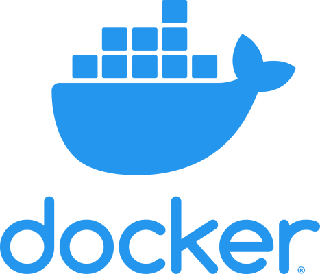
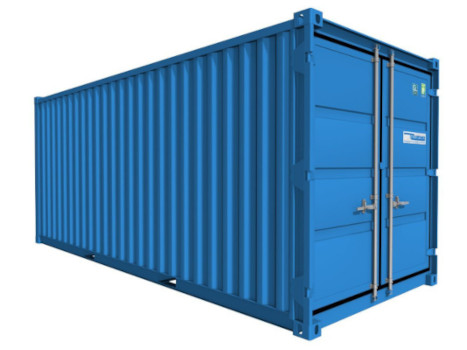
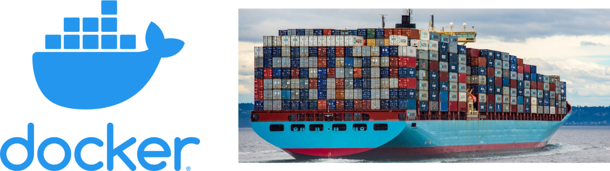
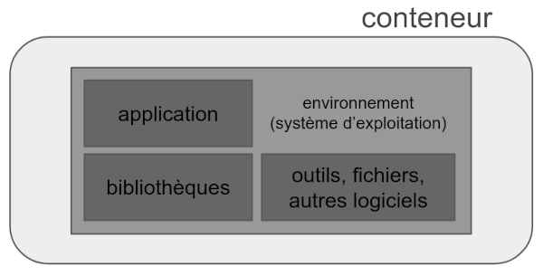
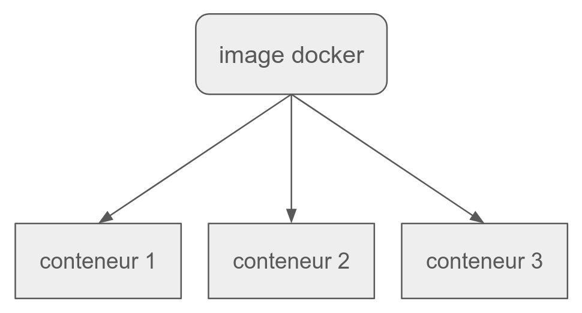
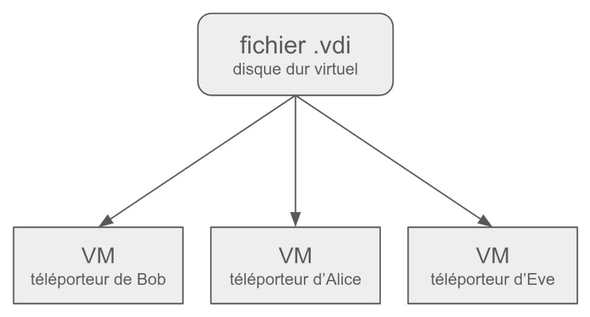
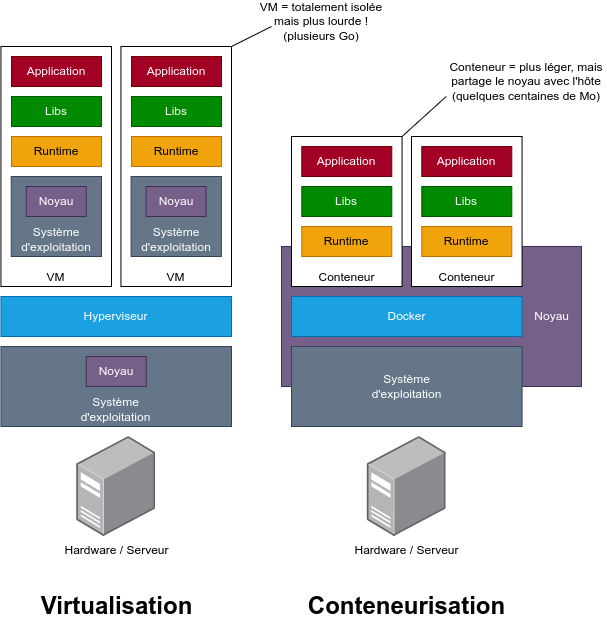
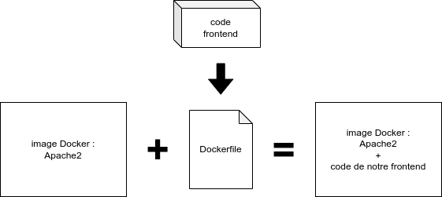
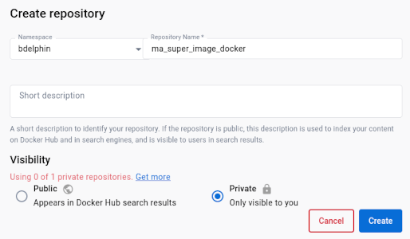
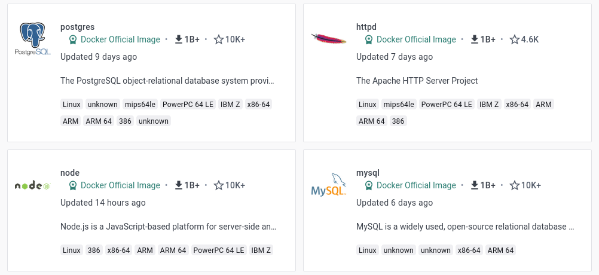

# Docker

Conteneurisation

---

Docker est un logiciel permettant d'exécuter des applications dans des **conteneurs**.

---

## Un conteneur ?

Ce truc-là ?

--

Pas tout à fait, nous on parle de **conteneurs logiciels**.

Mais le terme "conteneur" est bien inspiré des conteneurs maritimes, d'ailleurs le logo de Docker représente une "baleine porte-conteneur" !

---

## Ça sert à quoi, Docker ?

_Hey, ma version de Node.js en locale et celle du serveur de production n'est pas la même, il n'y a rien qui marche !_

_Hey, ça marchait sur ma machine !_

--

Et bien c'est justement l'idée derrière Docker :

Si ça fonctionne sur l'environnement de dév, **on livre l'environnement de dév en prod !**

--

**Docker permet, entre autres :**

- de plus facilement déployer une application en production
- de pouvoir **mettre en place rapidement un environnement de développement identique à l'environnement de production**
- de supporter les montées en charge

---

## Ça fonctionne comment ?

Il y a deux termes à connaître pour bien comprendre comment Docker fonctionne :

- les **conteneurs Docker**
- les **images Docker**

---

## Conteneur Docker

Un conteneur est **une "enveloppe" virtuelle qui permet de distribuer une application avec tous les éléments dont elle a besoin pour fonctionner** : code source / binaire de l'application, environnement d'exécution, bibliothèques, outils et fichiers divers.

--

Prenons un premier exemple : **un simple site statique**

Un conteneur permettant de distribuer ce frontend avec tout ce dont il a besoin pour fonctionner sera composé de :

- **application :** code source HTML/CSS/JS
- **environnement d'exécution :** serveur web (Apache ou NGinx)

--

Deuxième exemple : **une application avec un serveur backend**.

Un conteneur permettant de distribuer ce backend avec tout ce dont il a besoin pour fonctionner sera composé de :

- **application :** code source PHP ou JS du backend
- **environnement d'exécution :** serveur web Apache pour PHP, NodeJS pour JS
- **bibliothèques :** dossier `vendor` pour PHP, dossier `node_modules` pour JS
- **outils et fichiers divers :** Composer pour PHP, NPM pour JS

---

## Image Docker

En POO, on dit **qu'un objet est l'instance d'une classe**.

Avec Docker : **un conteneur Docker est l'instance d'une image**.

--

On peut créer **un nombre infini de conteneurs à partir d'une même image Docker** !

--

*Mais concrètement, c'est quoi une image ?*

Une image Docker est un fichier **immuable** (qu'on ne peut pas modifier) qui est une **capture instantanée du système de fichiers** d'un conteneur.

En quelque sorte, c'est comme si on prenait une "photo" du contenu du disque dur de notre VM Serveur Kourou, en fin de journée après avoir tout installé dessus. 

---

## Virtualisation vs. Conteneurisation

--

On peut faire le parallèle avec la virtualisation :

Votre téléporteur est une **machine virtuelle** (Virtual Machine / VM en anglais). Cette VM embarque tous les logiciels nécessaires pour votre formation.

Chez O'clock, on a préparé cette VM puis on vous a mis à disposition un fichier avec l'extension `.vdi` (le disque dur virtuel de la VM), une fois tous les logiciels installés.

--

On peut créer plusieurs **instances** (plusieurs VMs = équivalent à un conteneur) à partir d'un même disque dur virtuel (équivalent à une image Docker).

--

### Différences entre virtualisation et conteneurisation

Une machine virtuelle embarque un **système d'exploitation complet**, ce n'est pas le cas avec un conteneur Docker, qui partage certains composants avec l'hôte sur lequel il est lancé (notamment **le noyau / kernel**).

En conséquence, une machine virtuelle peut être très lourde (de plusieurs Gigaoctets à plusieurs dizaines de Go !), là où **un conteneur Docker sera plus léger** (quelques centaines de Mo en général).

--

---

## Images immuables

Les images Docker, en quelques sortes les "disques durs virtuels" de nos conteneurs, sont **immuables**.

Ça veut dire qu'**on ne peut pas les modifier**. *Mais comment on fait du coup pour installer nos logiciels et y placer notre code ?* 🤔

--

### Dockerfile

Pour créer **notre propre image Docker**, on va partir d'une **image existante**.

Grâce à un fichier de configuration spécifique à Docker, le **Dockerfile**, on va pouvoir indiquer à Docker ce qu'on veut **ajouter** sur l'image existante.

Nous découvrirons la syntaxe et les commandes à utiliser pour rédiger et utiliser un Dockerfile plus tard.

--

**Exemple pour créer une image Docker de notre frontend** :

Le **Dockerfile** permet de copier des fichiers dans une image, lancer des commandes, installer des logiciels ou dépendances, etc.

L'image d'origine, embarquant le logiciel Apache2, a elle aussi été construite en utilisant un Dockerfile.

--

Pour utiliser Docker avec nos projets, nous n'avons **pas forcément besoin de créer nos propres images Docker avec un Dockerfile** !

On peut se contenter d'utiliser des images existantes, comme par exemple celle d'Apache2. *Mais on les récupère où, ces images ?* 🤔

---

## DockerHub

Comme pour Git & Github, avec Docker on a **DockerHub** !

[https://hub.docker.com/](https://hub.docker.com/)

--

DockerHub est un site web sur lequel on peut **héberger nos images Docker dans des dépôts** (repository).

Comme sur Github avec nos dépôts Git, on pourra choisir si nos dépôts d'images Docker sont **publics ou privés**. Avec l'offre gratuite, nous sommes limités à un seul dépôt privé.

--

Dans les nombreux dépôts publics, on retrouve des images Docker prêtes à l'emploi qui vont nous être très utiles comme base pour **construire nos propres images** ou mettre en place nos **environnements de développement et de production**.

Explorez les suggestions !

---

## Docker Compose

*On va donc devoir créer une image contenant notre frontend, notre backend, et la base de données ?* 🤔

Non ! On essaye en règle générale avec Docker de faire les choses de façon **modulaire**.

--

### Applications multi-conteneurs

Nos applications sont généralement composées de 3 parties, donc **divisées en trois conteneurs** :

- un conteneur pour le frontend
- un conteneur pour le backend
- un conteneur pour la base de données

Ainsi, on peut facilement **mettre à jour chaque conteneur indépendamment**. On peut aussi, sur des applications plus sollicitées, démarrer plusieurs conteneurs pour le front ou le back, afin de supporter **un plus grand nombre de requêtes**.

--

### 3 conteneurs, 3 images

On l'a dit, **un conteneur est l'instance d'une image Docker**.

Il va donc nous falloir **trois images Docker, une pour chaque conteneur de notre application**.

Pour faire fonctionner notre **application multi-conteneurs**, on utilisera **Docker Compose**, un "plugin" de Docker. On utilisera un fichier au format `YAML` (une alternative au `JSON`) pour configurer Docker Compose.

---

## Docker : pratique

Avant tout, il faut qu'on **installe Docker** !

- Sur Linux (recommandé), on installe généralement `Docker Engine`.
- Sur Mac ou Windows, on installe généralement `Docker Desktop` (qui intègre Docker Engine).
